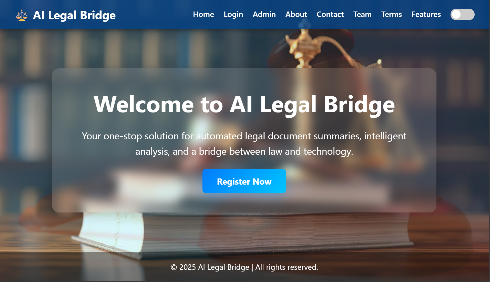

# ⚖️ AI Legal Bridge – Intelligent Legal Document Processing  

AI Legal Bridge is a Flask-based web application that simplifies handling of legal documents.  
It automatically **summarizes**, **translates into Kannada**, generates **audio narration (gTTS)**, and provides **PDF reports**.  
The platform also includes **authentication, admin tools, notifications, and history tracking**.  

---

## ✨ Features  

- 📂 Upload legal documents (`.txt` / `.csv`)  
- 🤖 AI Summarization (T5 / BART / LED models)  
- 🌐 Kannada Translation  
- 🔊 Audio narration using gTTS  
- 📄 PDF Report Generation  
- 👤 User authentication & profile management  
- 🕑 Upload history tracking  
- 📧 Email & 📱 SMS notifications (D7 Networks / Gmail SMTP)  
- 🛠️ Admin dashboard (manage users, export, search, edit, delete)  

---

## 🛠️ Tech Stack  

- **Backend**: Flask (Python)  
- **Database**: SQLite / MySQL with SQLAlchemy  
- **AI Models**: Transformers (T5, BART, LED)  
- **Other**: gTTS, PDF generation, D7 SMS API, Gmail SMTP  

---

## 🚀 Getting Started  

### 1️⃣ Clone the repository  
```bash
git clone https://github.com/kuberahs346/ai_legal_bridge.git
cd ai_legal_bridge
## 📸 Screenshots
Here’s a preview of the AI Legal Bridge dashboard:



